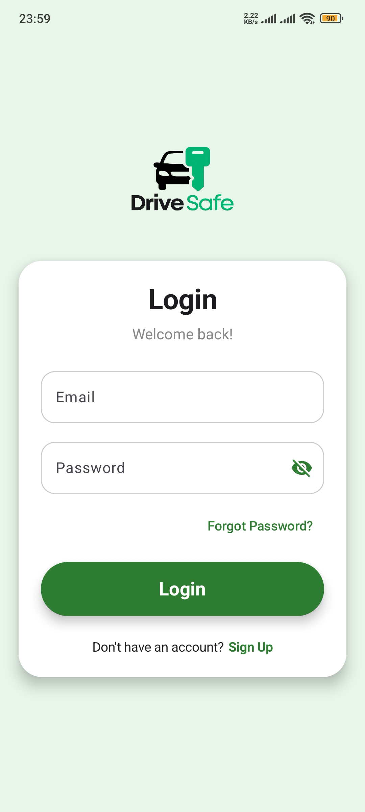
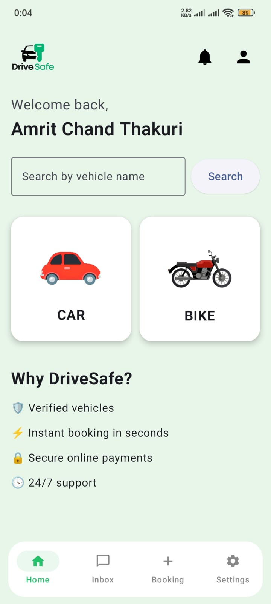
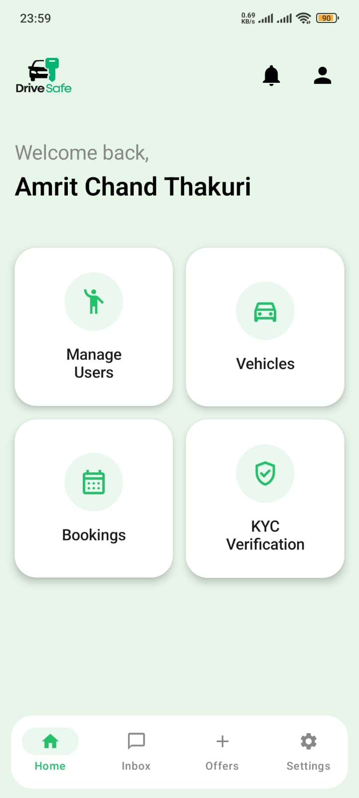
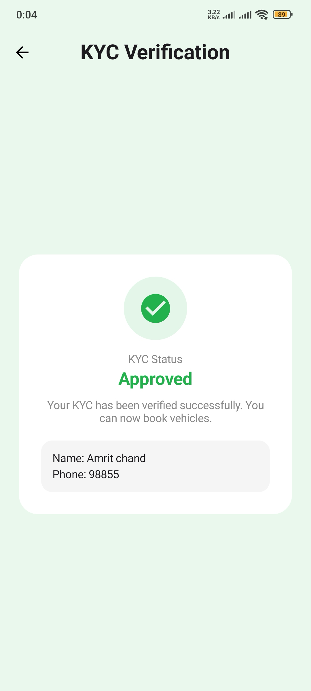
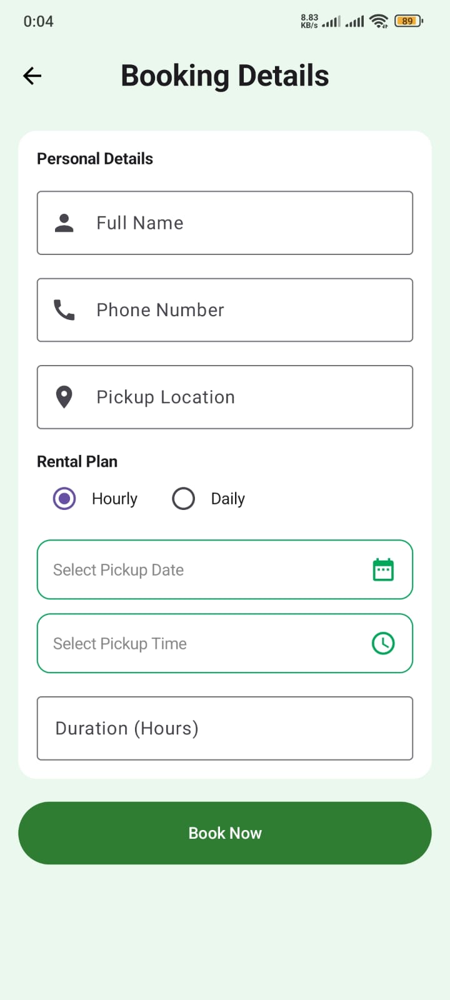
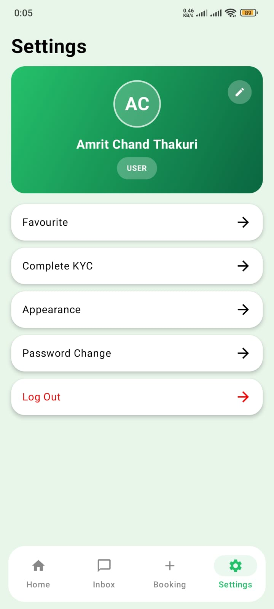

# DriveSafe — Vehicle Rental System

DriveSafe is a native Android application that digitizes the vehicle (car and bike) rental process — from browsing available vehicles to KYC-verified booking and in-app payment. It was built as a college project to demonstrate a complete, real-world mobile application using modern Android development practices: Jetpack Compose, MVVM architecture, Firebase as a serverless backend, and a real third-party payment gateway integration.

The app ships with two distinct experiences from a single codebase: a **User** app for browsing and booking vehicles, and an **Admin** app for managing the fleet, verifying users, and handling bookings.

---

## Table of Contents

- [Overview](#overview)
- [Key Features](#key-features)
- [Screens](#screens)
- [Architecture](#architecture)
- [Data Models](#data-models)
- [Tech Stack](#tech-stack)
- [Project Structure](#project-structure)
- [Getting Started](#getting-started)
- [Testing](#testing)
- [Future Improvements](#future-improvements)
- [Team](#team)
- [License](#license)

---

## Overview

Renting a vehicle traditionally involves manual paperwork, in-person identity checks, and cash payments. DriveSafe replaces this with a mobile-first workflow:

1. A new user signs up and verifies their identity through an in-app **KYC** process.
2. Once approved by an admin, the user can browse cars/bikes, view details, and book a vehicle for a chosen date, time, and rental plan.
3. Payment is handled through the **Khalti** payment gateway.
4. Admins manage the vehicle inventory, approve/reject KYC submissions, track bookings, respond to user chats, and publish promotional offers.

## Key Features

**User side**
- Sign up / login with email & password, forgot/reset password
- KYC submission (name, phone, ID document, photo)
- Browse and search cars and bikes, filterable by brand
- Detailed vehicle pages (specs: capacity, engine, top speed, fuel type, price)
- Book a vehicle with pickup location, date, time, and rental plan; already-booked vehicles are blocked from double booking
- Pay for bookings via the Khalti checkout SDK
- View booking history ("My Bookings")
- Save vehicles to Favorites
- Leave customer reviews
- Real-time chat with admin support
- In-app notifications for booking updates and offers
- Light/dark theme feature

**Admin side**
- Central admin dashboard
- Manage vehicle inventory (add/edit/remove cars & bikes)
- Review and approve/reject user KYC submissions
- Manage and update booking status (approve, reject with reason, mark complete)
- Manage users
- Create and publish promotional offers
- Chat with users individually

## Screens

| Splash | Login | User Dashboard | Admin Dashboard |
|---|---|---|---|
|  |  |  |  |

| KYC Verified | Booking Form | Settings |
|---|---|---|
|  |  |  |

## Architecture

The app follows **MVVM (Model–View–ViewModel)** with a repository layer abstracting Firebase access, which keeps UI code (Compose) free of backend logic and makes the ViewModels unit-testable in isolation.

```
        ┌─────────────┐        ┌───────────────┐        ┌────────────────────┐        ┌──────────┐
        │    View     │  <-->  │   ViewModel   │  <-->  │     Repository      │  <-->  │ Firebase │
        │ (Compose UI)│        │ (state/logic) │        │ (interface + impl)  │        │  Backend │
        └─────────────┘        └───────────────┘        └────────────────────┘        └──────────┘
```

- **View** (`view/`) — Jetpack Compose screens and Activities; one Activity per major feature, hosting Composables. Purely presentational; delegates all logic to ViewModels.
- **ViewModel** (`viewmodel/`) — Holds UI state (via `LiveData`/`State`) and business logic for each feature area (Auth, Vehicle, Booking, Kyc, Chat, Favorite, Notification, Offer, Khalti, Theme).
- **Repository** (`repo/`) — One interface + Firebase implementation per domain (e.g. `BookingRepo` / `BookingRepoImpl`), isolating Firebase Auth/Firestore/Realtime Database calls behind a testable contract.
- **Model** (`model/`) — Plain data classes representing entities persisted to Firebase.

**External integrations**
- **Firebase Authentication** — email/password auth, link-based password reset
- **Firebase Realtime Database / Firestore** — vehicles, bookings, users, KYC records, chats, notifications, offers
- **Cloudinary** — image uploads (vehicle photos, KYC documents)
- **Khalti Checkout SDK** — in-app payment processing for bookings
- **Coil** — asynchronous image loading in Compose

## Data Models

| Model | Purpose | Key Fields |
|---|---|---|
| `UserModel` | Registered user/admin account | `uid`, `fullName`, `email`, `phone`, `role` |
| `VehicleModel` | Car/bike listing | `vehicleId`, `name`, `type`, `brand`, `number`, `price`, `capacity`, `engine`, `speed`, `fuelType`, `status` |
| `BookingModel` | A vehicle booking made by a user | `bookingId`, `userId`, `vehicleId`, `pickupLocation`, `pickupDate`, `pickupTime`, `rentalPlan`, `status`, `paymentStatus`, `transactionRefId` |
| `KycModel` | Identity verification submission | `name`, `phone`, `doc`, `photo` |
| `OfferModel` | Promotional offer | `id`, `title`, `description`, `discount`, `startDate`, `endDate` |
| `NotificationModel` | In-app notification | `id`, `title`, `message`, `createdAt` |
| `MessageModel` / `ChatListModel` | Chat messages and conversation threads between user and admin | — |

## Tech Stack

| Layer | Technology |
|---|---|
| Language | Kotlin |
| UI Toolkit | Jetpack Compose (Material 3) |
| Architecture | MVVM |
| Backend / Auth | Firebase Authentication, Realtime Database, Firestore |
| Media Storage | Cloudinary |
| Image Loading | Coil 3 |
| Payments | Khalti Checkout Android SDK |
| Unit Testing | JUnit, Mockito, Mockito-Kotlin |
| UI/Instrumented Testing | Espresso, Compose UI Test |
| Build System | Gradle (Kotlin DSL), version catalogs (`libs.versions.toml`) |

## Project Structure

```
drivesafe-rental-system/
├── app/
│   ├── src/
│   │   ├── main/
│   │   │   ├── java/com/example/drivesafe/
│   │   │   │   ├── model/       # Data classes (User, Vehicle, Booking, Kyc, Offer, Chat, Notification...)
│   │   │   │   ├── repo/        # Repository interfaces + Firebase-backed implementations
│   │   │   │   ├── viewmodel/   # ViewModels bridging UI and repositories
│   │   │   │   ├── view/        # Compose screens & Activities (user + admin)
│   │   │   │   └── ui/theme/    # App-wide Compose theming
│   │   │   ├── res/             # Strings, drawables, themes
│   │   │   └── AndroidManifest.xml
│   │   ├── test/                # JUnit unit tests (ViewModel logic)
│   │   └── androidTest/         # Espresso instrumented UI tests
│   ├── build.gradle.kts
│   └── google-services.json     # Firebase config (not committed — see Setup)
├── gradle/libs.versions.toml     # Centralized dependency versions
├── build.gradle.kts
└── settings.gradle.kts
```

## Getting Started

### Prerequisites

- Android Studio (latest stable release)
- JDK 11
- An Android device or emulator running **API 31 (Android 12)** or higher
- A [Firebase](https://console.firebase.google.com/) project with **Authentication**, **Realtime Database**, and **Firestore** enabled
- A [Cloudinary](https://cloudinary.com/) account (for image uploads)
- A [Khalti merchant/test account](https://docs.khalti.com/) (for payment checkout)

### Setup

1. **Clone the repository**
   ```bash
   git clone <repository-url>
   cd drivesafe-rental-system
   ```
2. **Connect Firebase** — create a Firebase project, register an Android app with package name `com.example.drivesafe`, download `google-services.json`, and place it in `app/`.
3. **Configure Cloudinary and Khalti** credentials in the relevant config files (`KhaltiConfig.kt` and your Cloudinary initialization) with your own API keys — do not commit real secrets to version control.
4. **Open in Android Studio** and let Gradle sync automatically.
5. **Run** the app on an emulator/device (`Shift+F10` or the Run button).

### Build from the command line

```bash
./gradlew assembleDebug      # Debug APK
./gradlew assembleRelease    # Release APK
```

## Testing

The project includes both unit and instrumented tests covering authentication, vehicle management, KYC, and offers.

```bash
./gradlew test                    # Unit tests (JVM, Mockito-based ViewModel tests)
./gradlew connectedAndroidTest     # Instrumented UI tests (requires a connected device/emulator)
```

Notable test coverage:
- `AuthUnitTest`, `LoginInstrumentTesting`, `SignUpInstrumentTesting` — authentication flows
- `VehicleViewModelTest`, `AdminManageVehicleInstrumentedTest` — vehicle CRUD
- `KycViewModelTest`, `ManageKycVerificationInstrumentedTest` — KYC review flow
- `OfferViewModelTest`, `OfferInstrumentedTest` — offer management
- `ChangePasswordInstrumentedTest` — account settings

## Future Improvements

- Push notifications via Firebase Cloud Messaging
- Real payment gateway production credentials (currently test/sandbox integration)
- Vehicle availability calendar view
- Multi-language support
- CI pipeline for automated test runs on pull requests

## Team 

- **Project:** DriveSafe — Vehicle Rental System
- **Author(s):** Amrit Chand , Aman Rauniyar , Prajeeta Joshi , Gyanu Singh 


## License

This project was developed for academic purposes. No formal license has been applied — contact the author(s) before reuse or redistribution.
